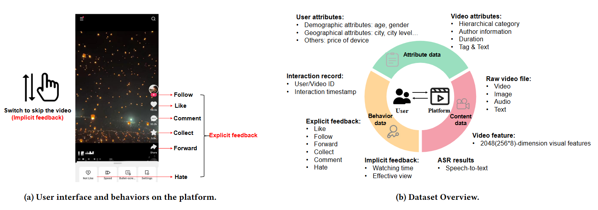

## Short-video dataset
<p align="center">
  
</p>

The dataset and codes of submission "**A Large-scale Dataset with Behavior, Attributes, and Content of Mobile Short-video Platform**".

The full dataset is available at http://101.6.70.16:8080/ (**Username:** videodata **Password:** ShortVideo@10000).

For convenient review, we also provide a sampled version at the link: https://www.dropbox.com/scl/fo/5z7pwp6xjkrr1926vreu6/AFYter5C6BDTOCpxkxF0k9Y?rlkey=p28j6u1fl1ubb7bufiq16onbl&st=7aktff85&dl=0.

### I. The detailed introduction of the dataset

#### Main files

- **raw\_file:** the folder containing original video files with the format "video_id.mp4".

- **video\_feature\_total:** the folder containing all extracted visual features with the format "video_id.npy".

- **interaciton.csv:** the file containing all behavior data and attribute data.

- **asr_zn:** ASR text in Chinese of each video with the format "video_id.txt".

- **asr_en:** ASR text in English of each video with the format "video_id.txt".

- **title_en:** Video title in English of each video with the format "video_id.txt".

- **category_cn_en.csv:** 3-level video categories in both English and Chinese.

#### Details of behavior data

| **Field Name** | **Type** | **Description**                                                       | **Example** |
|:---------------------:|:-----------------:|:------------------------------------------------------------------------------:|:--------------------:|
| user\_id              | numeric           | user ID(after hashing), each representing a real user of the platform          | 101                  |
| pid                   | numeric           | video ID(after hashing), each representing a video collected from the platform | 2023                 |
| exposed\_time         | numeric           | Unix timestamp of the interaction                                              | 1663471335           |
| p\_date               | numeric           | date when the interaction happened                                             | 20220917             |
| p\_hour               | numeric           | the hour when the interaction happened                                         | 11                   |
| watch\_time           | numeric           | the given user's watching time towards the given video(seconds)                | 46                   |
| cvm\_like             | bool              | whether the given user gives a like towards the given video                    | True                 |
| comment               | bool              | whether the given user comments for the given video                            | False                |
| follow                | bool              | whether the given user follows the given video                                 | False                |
| collect               | bool              | whether the given user collects the given video                                | True                 |
| forward               | bool              | whether the given user forwards the given video                                | False                |
| effective\_view       | bool              | whether the watching time surpasses 3 seconds                                  | True                 |
| hate                  | bool              | whether the given user gives a hate towards the given video                    | False                |

#### Details of attribute data

#### Video attributes:
<p align="center">
  <strong>Illustrative cases</strong>
</p>

<p align="center">
  
</p>


|  **Field Name**   | **Type** |                       **Description**                        |          **Example**           |
| :---------------: | :------: | :----------------------------------------------------------: | :----------------------------: |
|  category_level   | numeric  | the level of category ID(1: primary category; 2: secondary category; 3: Tertiary category) |               3                |
|    category_id    | numeric  |            the tertiary category ID of the video             |              1350              |
|     parent_id     | numeric  |            the secondary category ID of the video            |              288               |
|      root_id      | numeric  |             the primary category ID of the video             |               39               |
|     duration      | numeric  |             duration of the given video(seconds)             |            138.566             |
|     author_id     | numeric  |           ID of the video’s author(after hashing)            |               78               |
| author_fans_count | numeric  |             number of fans of the video’s author             |             138211             |
|     tag_name      |   text   |                     video’s content tag                      |    ’underwater photography’    |
|       title       |   text   |                      title of the video                      | ’Catch lobsters under the sea’ |

#### User attributes:

|   **Field Name**   | **Type** |              **Description**              |    **Example**    |
| :----------------: | :------: | :---------------------------------------: | :---------------: |
|       gender       |   text   | the user’s gender(’M’: male; ’F’: female) |        'M'        |
|        age         | numeric  |              the user’s age               |        34         |
|     mod_price      | numeric  |        the price of user’s phones         |       1899        |
|      fre_city      |   text   |       the city the user locates in        |    'Shanghai'     |
| fre_community_type |   text   |           user’s residence type           |     'country'     |
|   fre_city_level   |   text   |             user’s city level             | 'first-tier city' |


### II. Codes for data processing

- **video_feature_process.py:** the code for extracting video visual features.

- **text_feature_process.py:** the code for extracting video textual features from titles.

- **sensevoice.py:** the code for extracting ASR texts from videos with SenseVoice model.


### III. Codes for running recommendation benchmarks

1. Download the processed dataset for recommendations from the [link](https://www.dropbox.com/scl/fo/ha0e0wolgqgg5qskr52l1/AHZUySejwWJzfyJy8WGo2k4?rlkey=xwpqosx7b906yb7g8nwy53oqh&st=slry1d1l&dl=0).

2. Set up environment according to [MMRec](https://github.com/enoche/MMRec).

3. Put the 3 downloaded files in the 'data' folder and create a file named 'video.yaml' under 'src/configs/dataset/'.

4. Run the recommendation algorithm.
```
cd src
python main.py --dataset video
```

